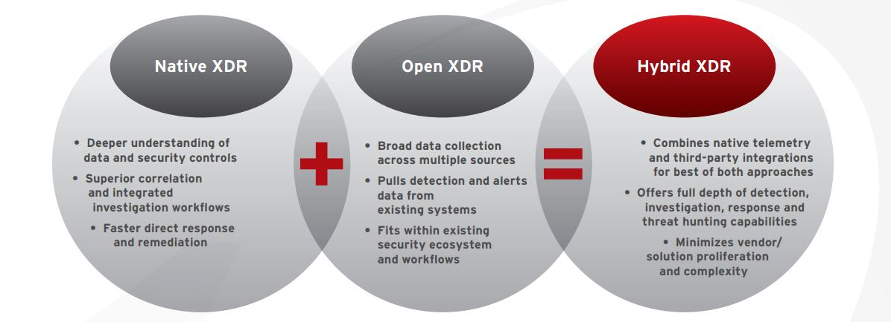

### Correlating Needles in the Alert Needle-stack

<!-- https://newsroom.trendmicro.com/2021-05-25-70-Of-SOC-Teams-Emotionally-Overwhelmed-By-Security-Alert-Volume
-->

With the digital transformation creating so many sweeping changes to the modern business, often under-discussed is the human cost of managing security of the evolving business environment. In a global study of over 2,300 IT security and SOC decision makers across companies of all sizes and verticals, more than 50% said their teams were overwhelmed by the number of security alerts. Furthermore, 55% admit they aren’t entirely confident in their ability to prioritize and respond to them.

Common to the SOC environment is usage of a SIEM to collect logs and alerts from multiple, disparate security tools, but this setup can beget several issues:

1. Cyberattacks rarely stay in siloes, resulting in tracking data and findings of various fidelity or importance levels across several product consoles.
2. SIEMs excel at ingesting data, but are not necessarily equipped to correlate that data, especially cross-product.

This hampered visibility and lack of consistent context can lead to low-fidelity alerts resulting in false positives, slowing down investigative efforts. To remedy these issues, one potential approach to consolidate reactive security workflows with an extended detection and response (XDR) platform approach.

---

#### What is XDR?

XDR is the evolution of the traditionally familiar endpoint detection and response (EDR), the single-vector threat handling approach for actively managed endpoints. XDR welcomes that endpoint data into a greater data lake structure and correlates it with findings across other vectors like email, cloud workload,  and network layers. Establishing this correlation increases high-confidence detections and reduces the volume of false positives that arise from the issues discussed in the previous section.

Another way to minimize security complexity while maximizing system capability is to adopt a "hybrid XDR" approach: building off a natively employed base XDR solution with third-party integrations.

At its most effective, a comprehensive XDR strategy should be able to answer the following questions:

- How did a given user/host become compromised?
- What was the first point of entry?
- What or who else is part of the same attack?
- Where did the threat originate?
- How did the threat spread?
- How many other users are potentially vulnerable to the same threat?

---
